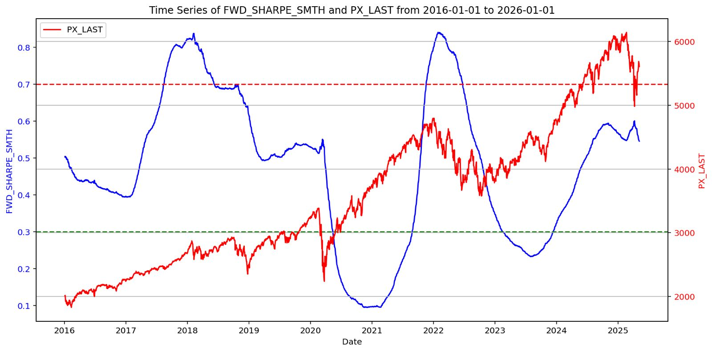

# 📊 SPX Barometer Model: Forward Sharpe Ratio

This model provides a **risk-adjusted valuation signal** for the S&P 500 Index (SPX), based on a stylized 1-year discounted cash flow (DCF) approach. The resulting metric, called the **Forward Sharpe Ratio (FWD_SHARPE)**, quantifies the equity risk premium (ERP) relative to realized volatility, offering a directional gauge for medium-term equity market outlook.

---

## 🔍 Signal Interpretation

The model classifies daily values of FWD_SHARPE into one of three regimes:

| FWD_SHARPE Range | Signal | Meaning |
|------------------|--------|---------|
| **0.00 – 0.30**  | 🟢 **Buy**  | Market is **undervalued** → Strong upside potential |
| **0.30 – 0.70**  | 🟡 **Hold** | Market is **fairly valued** → Cautious neutrality |
| **0.70 – 1.00**  | 🔴 **Sell** | Market is **overvalued** → Low or negative risk-adjusted return |

These thresholds are used both numerically and visually in the **Plotly gauge chart**.

This logic now applies to **both SPX and TOPIX**, and can be extended to additional indices if scaled accordingly (see section below on `barometer_scaler`).

---

## 🧠 Model Logic

### 🧮 Step 1: Estimate Required Rate of Return (RORR)

The model infers the **required rate of return** \\( r \\) implied by the market using a 1-year DCF-like valuation identity. Given:

- \\( P \\): Current index level (`PX_LAST`)
- \\( g \\): Estimated growth rate, derived as:

\[
g = (1 - \text{Payout Ratio}) \times \text{ROE}
\]

- \\( D_0 \\): Current-year dividend estimate (`IDX_EST_DVD_CURR_YR`)
- \\( D_1 \\): Next-year dividend estimate (`IDX_EST_DVD_NXT_YR`)

The goal is to solve for \\( r \\) in the identity:

\[
P = \frac{D_0 + \frac{D_1}{(1 + r)}}{1 + g}
\]

The implementation solves this as a quadratic equation to back out \\( r \\), matching logic commonly used in Excel. If no real solution exists (i.e., negative discriminant), the result is `NaN`.

---

### 📈 Step 2: Calculate Equity Risk Premium (ERP)

Once \\( r \\) (i.e., `RORR`) is derived, the model subtracts the 12-month Treasury yield (`USGG12M`) to compute the **Equity Risk Premium**:

\[
ERP = RORR - \text{USGG12M}
\]

---

### ⚖️ Step 3: Normalize via Realized Volatility

To express ERP in risk-adjusted terms, we divide by 360-day realized index volatility:

\[
\textbf{FWD\_SHARPE} = \frac{ERP}{\text{VOLATILITY\_360D}} - 0.1
\]

The subtraction of `0.1` acts as a **risk penalty or margin of safety**.

This final metric, **FWD_SHARPE**, represents the forward-looking Sharpe ratio of the index and is the core output of the model.

---

## 🧭 Multi-Market Support

The model now supports **TOPIX (TPX)** as well as SPX. The signal interpretation thresholds remain the same for all markets.

To normalize values for different indices, a custom scaling function is applied using the following method:

```python
def barometer_scaler(name, raw_series):
    if name == "SPX":
        result = (raw_series - 0.1).clip(lower=0, upper=1)
        return result
    elif name == "TPX":
        result = (2*raw_series - 0.2).clip(lower=0, upper=1)
        return result
    else:
        return "No scaling function defined for name"
```

## 📊 Historical Signal vs SPY

Below is a historical visualization of the FWD_SHARPE signal compared to SPY price levels from **2016 to 2025**:



This plot shows how:
- **Buy signals** (FWD_SHARPE < 0.3) precede multi-month equity rallies.
- **Sell signals** often cluster before corrections or weak return periods.

---

## 📦 Required Data Columns

The model expects a DataFrame (usually from an Excel/BQL export) with the following columns:

- `DATE` – Daily date column
- `PX_LAST` – Index closing level
- `IDX_EST_DVD_CURR_YR` – Current-year dividend forecast
- `IDX_EST_DVD_NXT_YR` – Next-year dividend forecast
- `DVD_PAYOUT_RATIO` – Index payout ratio
- `BEST_ROE` – Return on equity estimate
- `VOLATILITY_360D` – 1-year realized volatility
- `RF` – Risk-free Rate (typically 1Y government bond yield)

---

## ⚙️ Configuration & Use

- No additional configuration is needed; the model will display as intended after running `main.py`
- You can adjust the lookback period for the model's smoothing factor in this line (set at 30 by default):
```python
def process_spx_barometer(data, lookback=30):
    # ...
```

